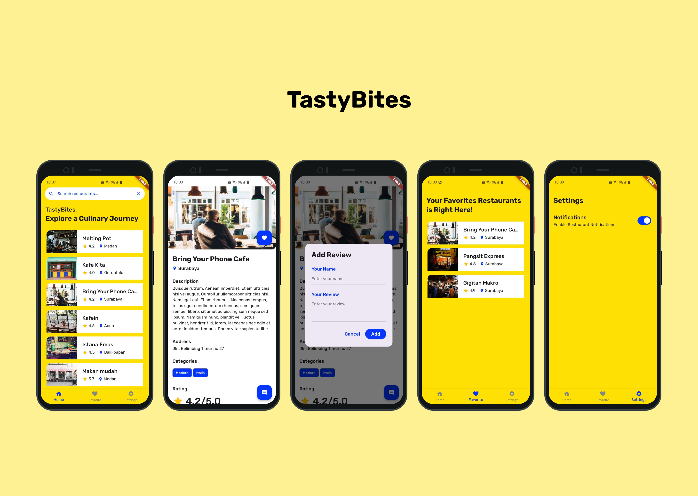

# TastyBites

TastyBites is a Flutter app developed for Dicoding's Flutter Fundamental Course. It allows users to explore, search for restaurants, add reviews, mark favorites, and receive daily notifications for featured restaurants.
#
## Technologies Used

- **Material3 Design**
- **HTTP** for API configuration
- **Provider** for state management
- **Sqlflite** for favorite database
- **Shared Preferences** for saving notifications state
- **Alarm Manager and Local Notifications** for scheduling and displaying daily notifications
- **Flutter Test** for testing data models
#
## Snapshot

